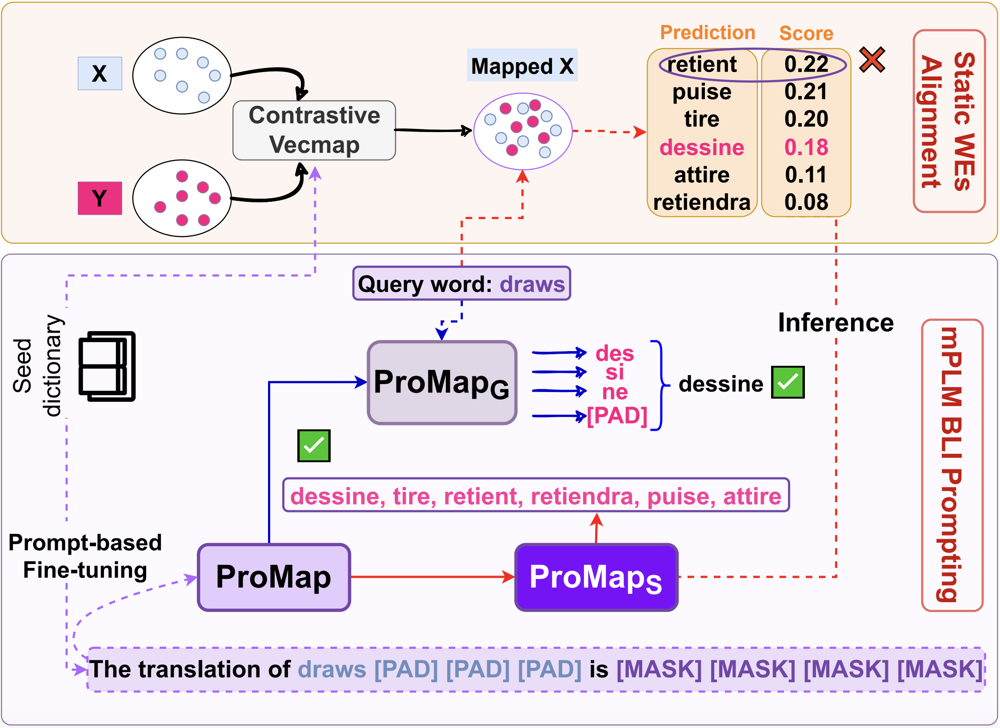

# ProMap: Effective Bilingual Lexicon Induction via Language Model Prompting

🏆 Promap won the Outstanding Paper Award (Machine Translation and Multilingualism) at IJCNLP-AACL 2023!

Codebase for the IJCNLP-AACL 2023 paper [ProMap: Effective Bilingual Lexicon Induction via Language Model Prompting](https://aclanthology.org/2023.ijcnlp-main.39/).




## Abstract

Bilingual Lexicon Induction (BLI), where words are translated between two languages, is an important NLP task. While noticeable progress on BLI in rich resource languages using static word embeddings has been achieved. The word translation performance can be further improved by incorporating information from contextualized word embeddings. In this paper, we introduce ProMap, a novel approach for BLI that leverages the power of prompting pretrained multilingual and multidialectal language models to address these challenges. To overcome the employment of subword tokens in these models, ProMap relies on an effective padded prompting of language models with a seed dictionary that achieves good performance when used independently. We also demonstrate the effectiveness of ProMap in re-ranking results from other BLI methods such as with aligned static word embeddings. When evaluated on both rich-resource and low-resource languages, ProMap consistently achieves state-of-the-art results. Furthermore, ProMap enables strong performance in few-shot scenarios (even with less than 10 training examples), making it a valuable tool for low-resource language translation. Overall, we believe our method offers both exciting and promising direction for BLI in general and low-resource languages in particular.


Resources used in this work:

- Language Models:
  [FacebookAI/xlm-mlm-17-1280](https://huggingface.co/FacebookAI/xlm-mlm-17-1280),
  [UBC-NLP/MARBERT](https://huggingface.co/UBC-NLP/MARBERT)
- Dictionnaries:
  [xling-eval](https://github.com/codogogo/xling-eval),
  [panlex-bli](https://github.com/cambridgeltl/panlex-bli),
  [MUSE bilingual dictionaries](https://github.com/facebookresearch/MUSE#ground-truth-bilingual-dictionaries),
  [MADAR](https://sites.google.com/nyu.edu/madar/)
- External BLI system used to generate top-`K` candidates for ProMapS:
  [ContrastiveBLI](https://github.com/cambridgeltl/ContrastiveBLI/)

## What is implemented

- `ProMapG`: bidirectional prompt-based masked language model training for bilingual lexicon induction. (Non-Autoregressive for predicting multiple [MASK] tokens in parallel)
- `ProMapS`: reranking of top-`K` candidates from another BLI system.

## Workspace assumptions

- dictionaries under `../dicts`
- saved ProMap outputs under `../preds`
- saved Arabic outputs under `../arabic_preds`
- optional local checkpoints such as `../marbert_S2T.pth`

## Install

```bash
pip install -r requirements.txt
```

## Input formats

The scripts expect three main kinds of inputs.

### 1. Dictionary files

- Format: plain text
- One translation pair (word level) per line
- Default separator: whitespace
- Shape per line: `source_word target_word`

Examples:

```text
house maison
river riviere
```

The training and test dictionary filenames are controlled by each YAML config through:

- `data_root`
- `train_path_template`
- `test_path_template`

For the multilingual configs in this repo, that means files such as:

- `../dicts/xling_5k/en_fr_train.txt`
- `../dicts/xling_5k/en_fr_test.txt`


### 2. Similarity candidates derived from embeddings

ProMapS does not consume raw embedding matrices directly. It expects a precomputed candidate table derived from bilingual embeddings or another nearest-neighbor retrieval step.

ProMapS is generic: it can rerank candidates from any BLI system as long as the candidates are exported in the format below. In the paper, we used [ContrastiveBLI](https://github.com/cambridgeltl/ContrastiveBLI/) as the base BLI model.

Accepted file types:

- `.pickle` / `.pkl`
- `.csv`
- `.tsv`
- `.txt` (tab-separated)

Required columns:

- `source`: source word as a string
- `candidate_top_k`: ordered list of candidate target words
- `candidate_scores`: ordered list of similarity scores aligned with `candidate_top_k`

Serialization rules:

- For `.pickle` / `.pkl`, `candidate_top_k` and `candidate_scores` should already be Python lists in the saved dataframe.
- For `.csv`, `.tsv`, and `.txt`, `candidate_top_k` and `candidate_scores` must be serialized as JSON arrays.

Example tab-separated row:

```text
house	["maison", "foyer", "logis"]	[0.91, 0.04, 0.01]
```

Notes:

- If `candidate_scores` are raw similarity scores, the code normalizes them with softmax using the temperature from the config.
- If `candidate_scores` are already probabilities, they are used as-is.

### 3. Prompt predictions and checkpoints

The reranking step also needs:

- a prompt-prediction pickle produced by `scripts/run_scenario.py`
- a PyTorch checkpoint `.pth` for the prompt model

The repo-generated prompt prediction pickles contain at least:

- `source`
- `target`
- `s2t_pred`
- `is_true`


### Config YAML files

Each experiment config in `configs/` is a YAML file. The minimum fields are:

- `name`
- `pretrained_path`
- `data_root`
- `pairs`

Common optional fields are:

- `train_path_template`
- `test_path_template`
- `prediction_token`
- `padding_token`
- `num_prediction_tokens`
- `similarity_candidates_dir`
- `similarity_path_template`

The configs shipped in this repo are limited to the paper-approved model/data combinations:

- `configs/multilingual_xling_5k.yaml`
- `configs/muse_xlm17.yaml`
- `configs/panlex_xlm17_1k.yaml`
- `configs/madar_marbert.yaml`

## Run

### Run ProMapG only

Train the prompt model and save its checkpoint and prompt predictions:

```bash
python scripts/run_scenario.py --config configs/multilingual_xling_5k.yaml --skip-rerank --pairs en_fr
```

This writes files such as:

```bash
outputs/multilingual_xling_5k/checkpoints/en_fr.pth
outputs/multilingual_xling_5k/prompt_predictions/en_fr_prompt.pkl
```

### Run ProMapS only

Rerank exported candidates from any BLI system using an existing ProMapG checkpoint and prompt-prediction pickle:

```bash
python scripts/rerank_predictions.py \
  --config configs/multilingual_xling_5k.yaml \
  --checkpoint outputs/multilingual_xling_5k/checkpoints/en_fr.pth \
  --prompt-predictions outputs/multilingual_xling_5k/prompt_predictions/en_fr_prompt.pkl \
  --candidates path/to/candidate_exports/en_fr_candidates.tsv \
  --output outputs/multilingual_xling_5k/reranked_predictions/en_fr_preds.pickle
```

The candidate file passed to `--candidates` must follow the standardized ProMapS format documented above. In the paper, these candidates were produced by [ContrastiveBLI](https://github.com/cambridgeltl/ContrastiveBLI/).

### Run ProMapG and ProMapS end to end

If your YAML config already points to a candidate directory and filename template, you can train ProMapG and immediately run ProMapS:

```bash
python scripts/run_scenario.py --config configs/multilingual_xling_5k.yaml
```

If your candidate exports live elsewhere, override them at runtime:

```bash
python scripts/run_scenario.py \
  --config configs/multilingual_xling_5k.yaml \
  --candidate-dir path/to/candidate_exports \
  --candidate-template '{src}_{tgt}_candidates.tsv'
```

### Summarize local results

Summarize the saved local results already in the workspace:

```bash
python scripts/summarize_local_results.py
```


## Citation

If you used this code in your research, please make sure to cite our work

```bibtex
@inproceedings{el-mekki-etal-2023-promap,
    title = "{P}ro{M}ap: Effective Bilingual Lexicon Induction via Language Model Prompting",
    author = "El Mekki, Abdellah  and
      Abdul-Mageed, Muhammad  and
      Nagoudi, ElMoatez Billah  and
      Berrada, Ismail  and
      Khoumsi, Ahmed",
    editor = "Park, Jong C.  and
      Arase, Yuki  and
      Hu, Baotian  and
      Lu, Wei  and
      Wijaya, Derry  and
      Purwarianti, Ayu  and
      Krisnadhi, Adila Alfa",
    booktitle = "Proceedings of the 13th International Joint Conference on Natural Language Processing and the 3rd Conference of the Asia-Pacific Chapter of the Association for Computational Linguistics (Volume 1: Long Papers)",
    month = nov,
    year = "2023",
    address = "Nusa Dua, Bali",
    publisher = "Association for Computational Linguistics",
    url = "https://aclanthology.org/2023.ijcnlp-main.39/",
    doi = "10.18653/v1/2023.ijcnlp-main.39",
    pages = "577--597"
}
```
